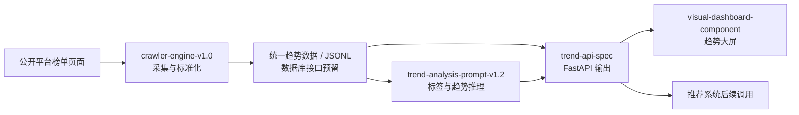

# 全网风向标 `novel-trend-windvane`

网络小说智能推荐系统的趋势洞察模块，用于回答：当前公开网络小说市场正在流行什么，哪些题材、标签、榜单作品与内容元素正在上升或衰退。

> 当前交付状态：**阶段 1 - 项目骨架**。本阶段仅创建目录边界与总览文档；爬虫、分析链、前端组件和 API 实现将在后续阶段逐步落入对应模块。

## 业务价值

“全网风向标”将公开榜单与作品信息整理为可消费的趋势信号，为推荐系统提供以下能力：

- 发现热门题材：聚合热搜、月票、推荐、新书、畅销和分类榜单中的高频标签。
- 识别上升作品：基于排名、热度和时间窗口观察增速与衰退。
- 识别来源平台：当前自动采集纵横中文网，起点暂不纳入前端展示，后续可作为人工导入或新适配器扩展。
- 分析流派迁移：识别“废土生存 -> 规则怪谈”等元素迁移关系。
- 生成趋势摘要：将数据变化转化为可阅读、可供 Agent 和产品调用的趋势报告。

## 模块职责

| 模块 | 职责 | 计划技术栈 | 主要交付物 |
| --- | --- | --- | --- |
| `crawler-engine-v1.0/` | 采集公开榜单及作品趋势数据，输出统一结构 | Python、Scrapy、Playwright、Docker Compose、Redis/Kafka 可选 | Spider、Middleware、Pipeline、容器配置 |
| `trend-analysis-prompt-v1.2/` | 从作品信息与榜单变化中抽取标签、流派演变与趋势摘要 | Python、LangChain、环境变量形式的 LLM 配置 | Prompt 模板、Chain 封装 |
| `visual-dashboard-component/` | 以趋势大屏方式展示热点、细标签趋势、流派迁移和上升作品 | React、TypeScript、ECharts、Vite | 图表组件、Mock/API 数据接入 |
| `trend-api-spec/` | 定义爬虫、分析 Agent 与前端之间的数据契约 | OpenAPI、FastAPI | API 文档、样例响应、演示服务 |

## 整体链路



## 目录结构

下列文件名表示最终交付布局。阶段 1 已创建模块及源码子目录，并提供本 README；各实现文件将在对应开发阶段加入。

```text
novel-trend-windvane/
├── README.md
├── RUNBOOK.md
├── crawler-engine-v1.0/
│   ├── scrapy.cfg                         # 阶段 3
│   ├── Dockerfile                         # 阶段 3
│   ├── docker-compose.yml                 # 阶段 3
│   ├── README.md                          # 阶段 3
│   └── novel_crawler/
│       ├── __init__.py                    # 阶段 3
│       ├── items.py                       # 阶段 2/3
│       ├── pipelines.py                   # 阶段 3
│       ├── settings.py                    # 阶段 3
│       ├── middlewares.py                 # 阶段 3
│       ├── playwright_middleware.py       # 阶段 3
│       └── spiders/
│           ├── __init__.py                # 阶段 3
│           ├── base_platform_spider.py    # 阶段 3
│           ├── qidian_spider.py           # 阶段 3
│           └── zongheng_spider.py         # 阶段 3
├── trend-analysis-prompt-v1.2/
│   ├── README.md                          # 阶段 4
│   ├── system_prompt.md                   # 阶段 4
│   ├── tag_extraction_prompt.md           # 阶段 4
│   ├── genre_evolution_prompt.md          # 阶段 4
│   ├── trend_summary_prompt.md            # 阶段 4
│   └── langchain_chains.py                # 阶段 4
├── visual-dashboard-component/
│   ├── README.md                          # 阶段 5
│   ├── package.json                       # 阶段 5
│   ├── tsconfig.json                      # 阶段 5
│   ├── vite.config.ts                     # 阶段 5
│   └── src/
│       ├── App.tsx                        # 阶段 5
│       ├── components/
│       │   ├── TrendDashboard.tsx         # 阶段 5
│       │   ├── HeatCurveChart.tsx         # 阶段 5
│       │   ├── DynamicWordCloud.tsx       # 阶段 5
│       │   ├── PlatformCompareChart.tsx   # 阶段 5
│       │   ├── GenreMigrationGraph.tsx    # 阶段 5
│       │   └── RisingWorksTable.tsx       # 阶段 5
│       ├── api/
│       │   └── trendApi.ts                # 阶段 2/5
│       └── mock/
│           └── trendMock.ts               # 阶段 5
└── trend-api-spec/
    ├── README.md                          # 阶段 6
    ├── openapi.yaml                       # 阶段 6
    ├── trend_api_spec.md                  # 阶段 6
    ├── sample_response.json               # 阶段 6
    └── fastapi_demo.py                    # 阶段 6
```

## 统一数据契约方向

后续模块围绕同一份趋势作品记录进行采集、分析和展示。阶段 2 将把该结构正式同步到 TypeScript 类型、爬虫 Item 与 OpenAPI Schema：

```ts
type TrendItem = {
  uid: string;  // SHA256(platform_id + "|" + novel_title), 64-char hex
  id: string;
  title: string;
  author?: string;
  platform: string;
  rank: number;
  rankChange?: number;
  category?: string;
  tags: string[];
  heatScore: number;
  listType: string;
  summary?: string;
  capturedAt: string;
};
```

API 统一响应外壳 (仪表盘端点):

```json
{
  "code": 0,
  "message": "success",
  "data": {},
  "timestamp": "2026-05-27T12:00:00Z"
}
```

Data Contract v1.0 端点 (`/api/v1/trend/*`) 使用扁平响应，直接返回符合 TrendData JSON Schema 的数据结构，详见 [System Integrator/data-contract-spec.md](../System%20Integrator/data-contract-spec.md)。

## 技术栈

| 场景 | 技术选择 |
| --- | --- |
| 公开页面采集 | Python、Scrapy、Playwright |
| 分布式与队列扩展 | Scrapy Cluster 思路、Redis 或 Kafka |
| 数据落地 | JSONL 起步，PostgreSQL 或 MongoDB 接口预留 |
| 智能分析 | LangChain Prompt/Chain，LLM 凭据仅从环境变量读取 |
| 接口服务 | FastAPI、OpenAPI |
| 趋势可视化 | React、TypeScript、ECharts，可按需接入 D3.js |
| 运行编排 | Docker、Docker Compose |

## 启动方式 (Windows)

完整交付运行步骤见 [RUNBOOK.md](./RUNBOOK.md)。常用入口如下：

```powershell
# 采集纵横榜单 (Docker)
cd crawler-engine-v1.0
docker compose --profile manual run --build --rm crawler-zongheng

# 趋势 API 服务 (端口 8001)
cd ../trend-api-spec
.venv\Scripts\activate
$env:TREND_DATA_DIR = "..\crawler-engine-v1.0\data"
$env:CRAWLER_DIR = "..\crawler-engine-v1.0"
$env:ALLOW_CRAWLER_RUN = "true"
uvicorn fastapi_demo:app --host 127.0.0.1 --port 8001 --reload

# Mock 模式 (无需采集)
uvicorn mock_server:app --host 127.0.0.1 --port 8001

# 前端趋势大屏
cd ../visual-dashboard-component
npm install
npm run dev -- --host 0.0.0.0
```

分析 Prompt 模块将通过 Python 导入使用，LLM 地址、模型和密钥使用环境变量配置，不在代码或文档中存储真实 Key。

## 开发阶段

| 阶段 | 输出内容 | 状态 |
| --- | --- | --- |
| 1 | 项目骨架与根 README | 已完成 |
| 2 | `TrendItem` 和 API 基础数据结构 | 待实现 |
| 3 | Scrapy/Playwright 爬虫示例与容器化运行 | 待实现 |
| 4 | LangChain Prompt 与三个分析 Chain | 待实现 |
| 5 | React + ECharts Mock 趋势大屏 | 待实现 |
| 6 | OpenAPI 文档与 FastAPI Mock 接口 | 待实现 |

## 合规边界

- 仅面向无需登录、无需付费、无需绕过限制的公开页面数据。
- 不规避验证码、访问控制、付费墙或平台安全措施。
- Spider 应采用低频率、随机延迟、重试上限和可人工调整的限速配置。
- 平台 URL、选择器、Cookie 注入入口和代理接口均将在配置层管理，便于合法维护。
- 本项目用于课程项目与公开数据趋势分析；上线使用前应复核目标站点规则和授权范围。
